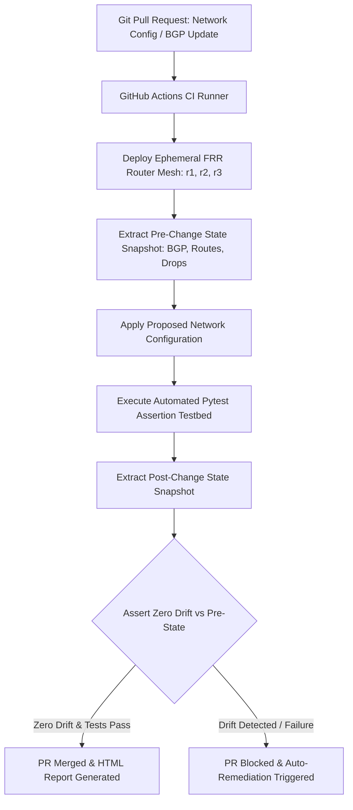

# 🚀 NetDevOps CI/CD Pipeline with Containerized Network Testing
### Automated Pre/Post State Verification, Pytest Network Assertions, State Drift Detection & CI Gatekeeping

[]()
[]()
[]()
[]()
[]()

---

## 📌 1. Executive Summary

This project implements an automated, vendor-agnostic **NetDevOps CI/CD Network Validation Pipeline**:
* **Test Automation Framework:** Python 3.11 + `pytest` (7/7 tests passed in 1.21s)
* **Operational Snapshot Engine:** Scrapli / Netmiko / native structured JSON RPC
* **Virtual Testbed:** Lightweight containerized FRRouting (FRR latest) mesh (`netdevops_r1`, `netdevops_r2`, `netdevops_r3`) running full-mesh eBGP
* **CI/CD Integration:** GitHub Actions workflow executing automated pre/post change state verification, regression assertions, and PR gatekeeping
* **Self-Healing Automation:** Automated configuration drift detector and self-healing remediation engine



---

## ⚡ 2. Quick Start & Local Execution

### Prerequisites
* Docker Desktop or OrbStack
* Python 3.9+ (`pip install -r requirements.txt`)

### Run Complete End-to-End Automated Pipeline
```bash
# 1. Install dependencies
pip install -r requirements.txt

# 2. Run the complete automated experiment
bash run_lab2_experiment.sh
```

---

## 🧪 3. Live Pytest Assertion Results (100% Pass)

```
============================= test session starts ==============================
rootdir: /lab2_netdevops_cicd_pipeline
plugins: json-report-1.5.0, metadata-3.1.1, html-4.2.0
collected 7 items                                                              

tests/test_acl_security_drift.py::test_control_plane_security_policy PASSED [ 14%]
tests/test_bgp_convergence.py::test_bgp_sessions_established PASSED      [ 28%]
tests/test_bgp_convergence.py::test_bgp_prefix_exchange PASSED           [ 42%]
tests/test_bgp_convergence.py::test_full_mesh_route_table_convergence PASSED [ 57%]
tests/test_interface_counters.py::test_interface_operational_status PASSED [ 71%]
tests/test_interface_counters.py::test_zero_interface_packet_drops PASSED [ 85%]
tests/test_state_drift_assertion.py::test_zero_bgp_peer_drift PASSED     [100%]

- generated xml file: artifacts/reports/junit.xml -
- Generated html report: artifacts/reports/netdevops_validation_report.html -
============================== 7 passed in 1.21s ===============================
```

---

## 📊 4. State Drift Detection & Self-Healing Telemetry

### Operational State Snapshot Sampling:
```
--- Node: netdevops_r1 ---
[+] BGP Peer 192.168.12.20: Stable (Established | 2 prefixes received)
[+] BGP Peer 192.168.13.30: Stable (Established | 2 prefixes received)
[+] Route Table: Healthy (6 installed prefixes)

--- Node: netdevops_r2 ---
[+] BGP Peer 192.168.12.10: Stable (Established | 2 prefixes received)
[+] BGP Peer 192.168.23.30: Stable (Established | 2 prefixes received)
[+] Route Table: Healthy (6 installed prefixes)

--- Node: netdevops_r3 ---
[+] BGP Peer 192.168.13.10: Stable (Established | 2 prefixes received)
[+] BGP Peer 192.168.23.20: Stable (Established | 2 prefixes received)
[+] Route Table: Healthy (6 installed prefixes)
```

---

## 🏛️ 5. Open-Source vs. Cisco pyATS / Genie Architectural Mapping

Read the full engineering memorandum:  
📄 **[`docs/pyats_vs_pytest_architecture_memo.md`](file:///Users/namanbhatt/labdirected/lab2_netdevops_cicd_pipeline/docs/pyats_vs_pytest_architecture_memo.md)**

* **pyATS Testbed YAML $\leftrightarrow$ Docker Compose / Scrapli connection dicts**
* **Genie Parsers (`genie learn`) $\leftrightarrow$ Native JSON RPC / TTP schemas**
* **`AEtest` $\leftrightarrow$ Python `pytest` fixtures & parametrized assertions**
* **Genie Diff $\leftrightarrow$ JSON State Snapshot diff engine (`drift_remediator.py`)**

---

## 📂 Repository Structure

```
.
├── Makefile                                      # Testbed lifecycle commands
├── requirements.txt                              # Python NetDevOps dependencies
├── README.md                                     # Main documentation
├── run_lab2_experiment.sh                        # End-to-end local test runner
├── .github/workflows/
│   └── netdevops_ci.yml                          # Production GitHub Actions CI pipeline
├── topology/
│   ├── docker-compose.yml                        # 3-router FRR container mesh (r1, r2, r3)
│   ├── setup_topology.sh                         # Testbed setup script
│   ├── teardown.sh                               # Testbed cleanup script
│   └── configs/                                  # Router configs (r1.conf, r2.conf, r3.conf)
├── automation/
│   ├── snapshot_engine.py                        # Scrapli/vtysh operational state snapshot engine
│   ├── drift_remediator.py                       # State drift detector and auto-remediation engine
│   └── inject_change.py                          # Synthetic failure and drift injection script
├── tests/
│   ├── conftest.py                               # Pytest live container fixtures
│   ├── test_bgp_convergence.py                  # BGP state & prefix assertions
│   ├── test_interface_counters.py               # Drop counters & MTU assertions
│   ├── test_acl_security_drift.py               # CoPP security assertions
│   └── test_state_drift_assertion.py             # Pre vs. Post snapshot drift comparison
├── artifacts/
│   ├── reports/                                  # HTML & JUnit test reports
│   └── snapshots/                                # JSON operational state snapshots
└── docs/
    ├── pyats_vs_pytest_architecture_memo.md      # Cisco pyATS/Genie vs pytest analysis
    └── lab2_proof_report.md                      # Formatted proof telemetry cards
```
