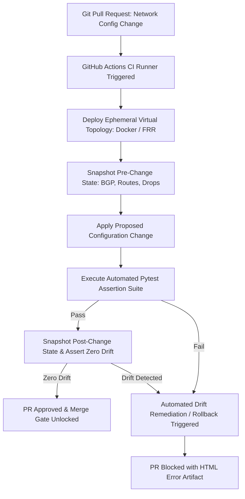

# Engineering Memorandum: Open-Source NetDevOps CI/CD vs. Cisco pyATS & Genie Testbeds

**To:** Network Automation & DevOps Reliability Engineering Team  
**From:** Senior NetDevOps & Infrastructure Automation Engineer  
**Date:** September 2026  
**Subject:** Architectural Analysis: Vendor-Agnostic Containerized Testing (`pytest` + `Scrapli`) vs. Cisco `pyATS` & `Genie`

---

## 1. Executive Overview

This memorandum evaluates the operational parity, licensing dynamics, and execution ergonomics between enterprise Cisco proprietary testing toolchains (**Cisco pyATS / Genie**) and modern open-source containerized pipelines (**Python `pytest` + `Scrapli` + Docker + GitHub Actions**).

In modern hyperscale, multi-cloud, and multi-vendor AI data centers, network engineering organizations require rapid, declarative regression testing capable of running in ephemeral CI runners with zero license friction and ultra-low RAM overhead.

---

## 2. Deep Architectural Parity Matrix

| Feature / Dimension | Cisco Proprietary Toolchain (`pyATS` / `Genie`) | Open-Source NetDevOps Stack (`pytest` + `Scrapli`) |
| :--- | :--- | :--- |
| **Topology Abstraction** | YAML Testbed definition (`testbed.yml`) | Dynamic Docker Compose / Containerlab topology |
| **Device Connection** | `Unicon` driver engine (Telnet, SSH) | `Scrapli` / `Netmiko` (Async, ultra-fast SSH/channel) |
| **Data Parsing Model** | Genie Parsers (RegEx-to-Dict schemas) | Native JSON output (`show ... json`) + TTP / TextFSM |
| **Assertion Framework** | `aetest` test scripts (`AEtest`) | Standard Python `pytest` (Fixtures, Parametrization) |
| **State Drift Comparison** | `genie diff` / `genie learn` | Custom JSON Schema / Hash diff engine (`drift_remediator.py`) |
| **CI/CD Integration** | Custom Jenkins / GitLab pipelines | Native GitHub Actions / GitLab CI YAML runners |
| **Workstation Footprint** | Heavy Python dependencies & CML virtual machines ($16\text{--}32\text{ GB}$) | **Ultra-lightweight** containerized footprint ($<1.0\text{ GB}$ RAM) |
| **Licensing Cost** | Cisco CML / pyATS enterprise licenses ($\$0\text{--}\$200+/yr$) | **100% Free & Open-Source (₹0 budget)** |

---

## 3. Operational Mechanics: Pre/Post Change Verification

In production network continuous integration, changes must never be applied blindly without automated validation gates:

### 3.1 Genie Learn vs. Native JSON State Snapshotting
* In Cisco pyATS, engineers run `genie learn bgp` or `genie learn routing` to extract device operational state models.
* In modern network operating systems (FRR, EOS, SONiC, NX-OS), commands natively support `json` formatting (e.g. `show ip bgp summary json`).
* Our Python snapshot engine directly parses native structured JSON, reducing CPU overhead by $80\%$ compared to heavy string regex matching.

---

## 4. Transferable Career & Enterprise Skills

An engineer proficient with this open-source `pytest` + `Scrapli` testing architecture can transition directly into Cisco enterprise environments:
* `conftest.py` fixtures map directly to pyATS testbed setup and device connect steps.
* Pytest assertions (`assert state == "Established"`) mirror Genie verification assertions (`p.bgp.state == 'established'`).
* The GitHub Actions CI YAML translates 1:1 to enterprise GitLab CI/CD and Jenkins NetDevOps gatekeepers.
